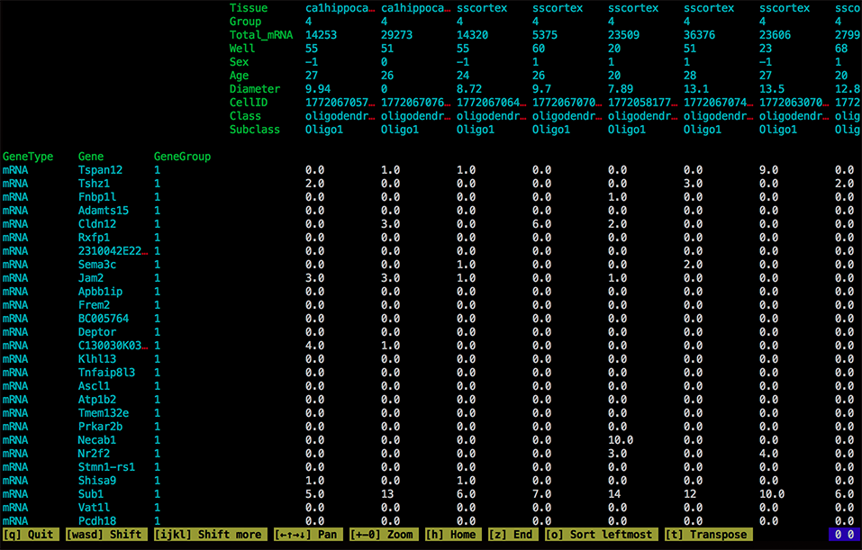

# ceftools

Tools for manipulating cell expression format (CEF) files.

You can download the latest version from the [releases page](https://github.com/linnarsson-lab/ceftools/releases).

## Overview

ceftools is a set of tools designed to manipulate large-scale gene expression data. It aims to be for gene 
expression data what [samtools](http://samtools.github.io) is for sequence data. It was designed to simplify the exchange
and manipulation of very large-scale transcriptomics data, particularly from single-cell RNA-seq. However, it can process
any omics-style dataset that can be represented as an annotated matrix of numbers.

ceftools is implemented as a command-line utility called `cef`, which operates on an annotated matrix of gene-expression 
values. The annotation consists of headers (name-value pairs) as well as row and column attributes. It supports useful operations such as filtering, sorting, splitting, joining and transposing the input. Multiple commands can be chained to perform more complex operations.

ceftools processes files in the text-based CEF format ('cell expression format', `.cef`). CEF files are human-readable, tab-delimited 
text files that can be easily parsed and generated from any scripting language. 

## Synopsis

	cef help			- print help for the cef command
	cef info            - overview of file contents
	cef view			- interactively navigate the matrix
	cef transpose 		- transpose the file
	cef sort			- sort by row attribute or by specific column
	cef add 			- add attribute or header with constant value 
	cef rename			- rename attribute
	cef drop 			- drop attribute(s) or header(s)
	cef import			- import from STRT
	cef rescale			- rescale rows (rpkm, tpm or log-transformed)
	cef join		  	- join two datasets by given attributes
	cef select			- select rows that match given criteria
	cef aggregate		- calculate aggregate statistics for every row


Commands operate on rows by default. For example `drop` can be used to remove row attributes, but not column attributes. Use the global `--bycol` flag to operate instead on columns. For example, to remove column attribute `Gene` then sort on column attribute `Length`:

```
< infile.cef cef --bycol drop Gene | cef --bycol sort Length > outfile.cef 
```

Note that since `--bycol` is a global flag it must always be positioned before the command: `cef --bycol <command>`

## Commands

The examples below make use of the `oligos.cef` sample dataset, which you can download from the [releases](https://github.com/linnarsson-lab/ceftools/releases) page. If you have installed `cef` and have `oligos.cef` in your current working directory, you should be able to run all the examples below without modification.


### Info

Show a summary of the contents of a CEF file.

Synopsis:

	cef info

Example:

	< oligos.cef cef info 

Output:

	          Columns: 820
	             Rows: 19972
	            Flags: 0
	          Headers:
	                   Genome = mm10
	                   Citation = http://www.sciencemag.org/content/347/6226/1138.abstract

	Column attributes: Tissue, Group, Total_mRNA, Well, Sex, Age, Diameter, CellID, Class, Subclass
	   Row attributes: GeneType, Gene, GeneGroup


### View

Interactively view the contents of a CEF file (in the terminal window).

Synopsis:

	cef view

Example: 
	
	< oligos.cef cef view

Ouput:



The yellow toolbar at the bottom shows the available commands for navigating the file.

Use the 'wasd' keys to scroll the matrix; hold down shift to scroll by a whole screen at a time. Press 'h' to jump to the top-left corner, and 'z' to jump to the bottom-right. 

Use the arrow keys to scroll the entire view (including the row and column attributes).

To sort by an attribute or column, use the arrow keys to scroll the view. Position the column you want to sort by at the left of you screen, then press 'o'. To reverse the sort order, press 'o' again.

To transpose rows and columns, press 't'.

Press 'q' to exit the viewer.


### Transpose

Transpose rows and columns.

Synopsis:

	cef transpose

Example:

	< oligos.cef cef transpose | cef info

Output:

	          Columns: 19972
	             Rows: 820
	            Flags: 0
	          Headers:
	                   Genome = mm10
	                   Citation = http://www.sciencemag.org/content/347/6226/1138.abstract

	Column attributes: GeneType, Gene, GeneGroup
	   Row attributes: Tissue, Group, Total_mRNA, Well, Sex, Age, Diameter, CellID, Class, Subclass

Compare this output to the example given above (*View* command).


### Sort

Sort the file based on a row attribute or the values in a specific column.

Synopsis:

	cef sort --by *attr=X*		Sort by the column where column attribute 'attr' has value 'X'
	cef sort --by *attr*		Sort by the row attribute 'attr'

	Options:

		--numerical				When sorting by row attribute, sort numerically (default: sort alphabetically)
		--reverse				Sort in reverse order

Example:

	< oligos.cef cef sort --by "CellID=1772067057_G07 --reverse > oligos_sorted.cef"

Output:

The output file is sorted by the first column, which has CellID '1772067057_G07', in descending order. You can verify this by doing `< oligos_sorted.cef cef view`.


### More commands

...work in progress...


## CEF file format

CEF files are tab-delimited text files in [UTF-8](http://en.wikipedia.org/wiki/UTF-8) encoding, no [BOM](http://en.wikipedia.org/wiki/Byte_order_mark). The first four characters are 'CEF\t' (that's a single tab character at the end), equivalent to the hexadecimal 4-byte number 0x09464543. CEF files are guaranteed to always begin with these four bytes, which can be used to identify the file format in the absence of a file name extension.

Each row has the same number of tab-separated fields, equal to `max(7, column count + row attribute count + 1)`. In other words, the entire file is a rectangular tab-delimited matrix, with at least seven columns. CEF file *readers* should accept CEF files that have less than the required number of fields in any row, and the missing fields should be interpreted as empty strings (but empty strings should not be interpreted as zeros; thus zeros must always be explicitly represented as '0'). CEF file *writers* should always generate a rectangular tab-delimited matrix.

Carriage returns before newline characters are silently removed. Fields may be quoted using double quotes; these are silently removed when fields are read. Tabs and newlines are allowed inside a quoted field.

The first line defines the file structure. It begins 'CEF', followed by header count, row attribute count, column attribute count, row count, column count, and the `Flags` value. 

This is followed by header lines, which are name-value pairs, with the name in the first column and the value in the second. There are no restrictions on either the names or the values. The order of headers is not necessarily preserved when CEF files are read and written. There can be multiple headers with the same name.

Next, the column attributes are given, each in a single row with an offset of `(row attribute count)`. Finally, the rows are given, starting with row attributes, and followed by the values of the main matrix. Values are represented in text as decimal floating-point numbers with no exponent (e.g. `-142.03939`) and must fit in a 32-bit IEEE-754 floating point number. The order of row and column attributes need to be preserved.

Example of a file with 1 header, 4 Row Attributes, 2 Column Attributes, 345 Rows, 123 Columns. The last number (0) in the first row is the `Flags` value, currently unused.

|   |   |   |   |    |    |    |
|---|---|---|---|----|----|----|
|CEF| 1 | 4 | 2 |345 |123 |  0 |
|Header name|Header value| | | | | |
|	|	|	|   |**Sex** |Male|Female|
|	|	|	|   |**Age** |P22|P28|
|**Gene**|**Chromosome**|**Position**|**Strand**|    |    |    |
|Actb|2|12837184|+|    |11 |24 |
|Nkx2-1|17|33432|-|    |0 |41 |
|   |   |   |   |    |    | ...|

Note that a CEF file can have zero row attributes, zero column attributes, and even zero rows or columns (in any combination). A CEF file without data, but with only row attributes, can be a useful way of storing annotations. Such a file can be joined to a data file to add the annotation to the data file.


## To-do list

	Tutorials for common tasks
	Rescale by given column attribute (mean centered)
	Import simple tables
	Support old-style Mac line endings
	Aggregate noise, maxcor, mincorr
	Left, right joins
	Parsers and generators for R, Python, MATLAB, Mathematica, Java, 
	Test suite for parsers and generators
	Validator for CEF files
	Fetch dataset from GEO SOFT
	Repository
